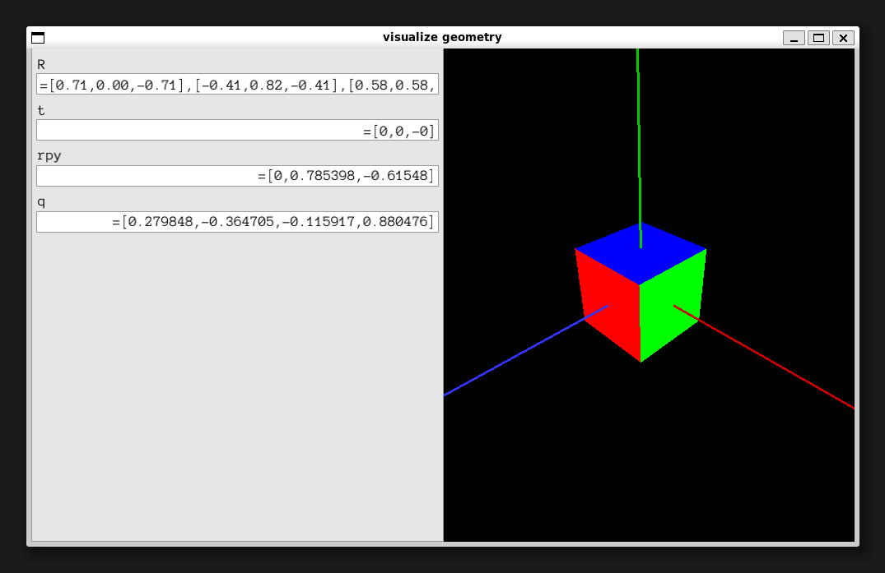

# Lecture 3 实践笔记：WSL2/Ubuntu Eigen、CMake 与 Pangolin 三维可视化

> 当前实际环境：WSL2 + Ubuntu 26.04 LTS，g++ 15.2.0、CMake 4.2.3；WSL 可见资源为 AMD Ryzen 7 8845HS 的 8 核 16 线程、约 7.4 GiB 内存和 2 GiB Swap。图形环境使用 WSLg，GPU 为 Radeon 780M 集成显卡。  
> 本讲对应高翔《视觉 SLAM 十四讲》第三讲实践，覆盖依赖安装、CMake 构建、Eigen 矩阵运算、Eigen 几何变换、Pangolin 3D 可视化，以及 WSL2 图形界面和 TIFF 链接错误的排查。  
> 重点记录：Eigen 作为头文件库的使用方式、三个独立示例的构建流程、WSLg 的使用、Pangolin 的 TIFF 链接问题，以及无头模式的替代方案。

---

## 一、当前工程结构与学习顺序

本讲的 C++ 示例不在讲义目录中，而在 `lecture_files/lecture_3` 下。三个子目录都是**独立的 CMake 小工程**，每个目录各自拥有一个 `CMakeLists.txt`、一个源文件和一个 `build` 构建目录：

```text
SLAM_Learning_for_myself/
├── lecture_files/lecture_3/
│   ├── Pangolin-master/
│   ├── useEigen/
│   │   ├── CMakeLists.txt
│   │   ├── eigenMatrix.cpp
│   │   ├── eigenMatrix              # 已有的可执行文件
│   │   └── build/
│   ├── useGeometry/
│   │   ├── CMakeLists.txt
│   │   ├── eigenGeometry.cpp
│   │   ├── eigenGeometry            # 已有的可执行文件
│   │   └── build/
│   └── visualizeGeometry/
│       ├── CMakeLists.txt
│       ├── visualizeGeometry.cpp
│       ├── Pangolin-master.zip      # Pangolin 源码压缩包
│       ├── visualizeGeometry        # 已有的可执行文件
│       └── build/
└── lecture_note/SLAM_lecture_3/Readme.md
```

三个示例建议按下面顺序学习：

| 示例 | 主要内容 | 运行结果 |
| --- | --- | --- |
| `useEigen` | 固定尺寸矩阵、动态矩阵、矩阵运算、特征值和线性方程求解 | 终端输出矩阵和计时结果 |
| `useGeometry` | 旋转矩阵、角轴、欧拉角、欧氏变换、四元数 | 终端输出旋转和位姿结果 |
| `visualizeGeometry` | Pangolin 窗口、相机交互、坐标轴、旋转和平移信息显示 | 弹出 3D 可视化交互窗口，实时显示旋转矩阵、平移、欧拉角和四元数 |

建议先理解 `useEigen` 的矩阵类型，再学习 `useGeometry` 的位姿表示，最后阅读 `visualizeGeometry` 中如何把相机状态转换成 Eigen 的旋转矩阵、平移向量、欧拉角和四元数。

### 当前硬件与 WSL 资源

以下是当前 WSL2 实例能够看到的资源。WSL 中的 CPU、内存、Swap 和磁盘容量可能受 Windows/WSL 配置限制，因此这些数据不等同于宿主机的完整硬件规格：

| 项目 | 当前值 | 对本讲的影响 |
| --- | --- | --- |
| 系统 | Ubuntu 26.04 LTS | WSL2 Linux 环境 |
| WSL 内核 | `6.18.33.2-microsoft-standard-WSL2` | 提供 Linux 系统调用和虚拟硬件环境 |
| CPU | AMD Ryzen 7 8845HS w/ Radeon 780M Graphics | 8 核 16 线程，可进行并行编译 |
| 内存 | 约 7.4 GiB | Eigen 小型示例占用较少，但 Pangolin 构建不宜无限增加并行任务 |
| Swap | 2.0 GiB | 内存不足时提供交换空间，但速度明显低于内存 |
| 图形环境 | WSLg，`DISPLAY=:0`、`WAYLAND_DISPLAY=wayland-0` | 支持 Pangolin GUI 图形窗口 |
| GPU | AMD Radeon 780M 集成显卡 | 当前不是 NVIDIA CUDA 环境，不能使用 `nvidia-smi` 判断 GPU |

可以用下面的命令重新检查环境：

```bash
cat /etc/os-release
uname -a
lscpu | grep -E 'Model name|CPU\(s\)|Thread|Core|Socket'
free -h
df -h /
printenv | grep -E 'WSL|DISPLAY|WAYLAND' | sort
```

当前内存约 7.4 GiB，三个示例的构建建议使用 `make -j4` 或 `cmake --build . --parallel 4`。虽然 CPU 显示 16 个逻辑线程，但直接使用 `-j16` 会同时启动更多编译任务，可能增加内存压力并触发 Swap；只有在确认资源充足时才提高并行数。

---

## 二、环境准备：编译工具与依赖安装

### 1. 基础编译工具安装

```bash
sudo apt update
sudo apt install g++ make cmake
```

- **g++**：C++编译器，负责将源码编译为可执行程序。
- **cmake**：构建脚本生成工具，读取`CMakeLists.txt`生成Makefile，不直接编译代码。

### 2. Eigen3 矩阵库安装

Eigen是SLAM中最常用的矩阵运算库，属于**纯头文件库（header-only）**，没有二进制库文件，只需包含头文件即可使用。

#### 正确安装方式

```bash
sudo apt install libeigen3-dev
```

- 包名必须带`-dev`后缀，否则找不到。
- 安装后头文件位于 `/usr/include/eigen3`。

#### 验证安装

```bash
ls /usr/include/eigen3
# 输出：Eigen  signature_of_eigen3_matrix_library  unsupported
```

看到`Eigen`目录即安装成功。

> 注意：Eigen库无需链接，编译时只需指定头文件路径，不会出现`undefined reference`错误。

### 3. Pangolin 与 TIFF 依赖

`visualizeGeometry` 依赖 Pangolin 的头文件和动态库，同时会间接使用图像模块依赖的 libtiff。基础依赖可以先安装：

```bash
sudo apt install libtiff-dev pkg-config
```

Pangolin 不是 Eigen 这样的 header-only 库，需要先安装或编译 Pangolin，使系统能够找到 `pangolin/pangolin.h`、Pangolin 库以及 CMake 配置文件。当前仓库的 `visualizeGeometry` 目录中还保留了 `Pangolin-master.zip`，它是源码压缩包，不等于已经安装完成；是否能够执行 `find_package(Pangolin REQUIRED)`，应以本机的 CMake 配置结果为准。

---

## 三、CMake 构建系统核心概念

### 1. CMake 角色与执行流程

CMake本身不是编译器，而是**构建系统生成器**：

- `cmake ..`：读取`CMakeLists.txt`，生成Makefile（配置阶段）
- `make`：根据Makefile调用g++完成编译和链接（构建阶段）
- 运行生成的可执行文件。

标准构建流程：

```bash
mkdir build && cd build
cmake ..
make -j4
./程序名
```

### 2. 头文件 vs 库文件

| 类型 | 作用 | 阶段 | 典型报错 | 解决方式 |
| --- | --- | --- | --- | --- |
| 头文件 `.h/.hpp` | 声明函数、类，供编译器检查 | 编译期 | `fatal error: xxx: No such file or directory` | `include_directories()` |
| 库文件 `.so/.a` | 函数二进制实现，供链接器使用 | 链接期 | `undefined reference to xxx` | `target_link_libraries()` |

- **Header-only库**（如Eigen）只有头文件，不存在链接错误。
- **完整库**（如Pangolin、OpenCV）需要同时配置头文件路径和链接库。

“编译通过”只说明源文件能够生成目标文件；还需要链接成功，程序才会生成。动态库缺失时，运行阶段仍可能失败。

### 3. 当前三个 CMake 配置的实际情况

当前仓库的配置并不完全相同，应按项目分别理解：

- `useEigen/CMakeLists.txt`：通过 `include_directories(/usr/include/eigen3)` 使用 Eigen，构建类型为 Release，并设置全局 `-O3` 优化。
- `useGeometry/CMakeLists.txt`：同样使用 `/usr/include/eigen3`，只生成 `eigenGeometry`，没有额外的库链接。
- `visualizeGeometry/CMakeLists.txt`：使用 `find_package(Eigen3 REQUIRED)` 和 `find_package(Pangolin REQUIRED)`，并额外链接 `tiff` 以及 Pangolin 库。

### 3. Eigen 示例 CMakeLists.txt

#### 课程经典写法（硬编码路径）

```cmake
cmake_minimum_required(VERSION 2.8)
project(useEigen)

set(CMAKE_BUILD_TYPE "Release")    # Release模式优化矩阵运算速度
set(CMAKE_CXX_FLAGS "-O3")         # 最高级别优化

include_directories(/usr/include/eigen3)
add_executable(eigenMatrix eigenMatrix.cpp)
```

#### 现代CMake写法（推荐，可移植性强）

```cmake
cmake_minimum_required(VERSION 3.10)
project(useEigen)

set(CMAKE_BUILD_TYPE Release)
set(CMAKE_CXX_STANDARD 14)         # 指定C++标准

find_package(Eigen3 REQUIRED)      # 自动查找Eigen

add_executable(eigenMatrix eigenMatrix.cpp)
target_include_directories(eigenMatrix PRIVATE ${EIGEN3_INCLUDE_DIR})
```

使用`find_package`和`target_include_directories`避免硬编码路径，更符合现代CMake规范。

对于 Eigen，也可以优先使用导入目标和目标级配置：

```cmake
cmake_minimum_required(VERSION 3.10)
project(useEigen)

set(CMAKE_BUILD_TYPE Release)
set(CMAKE_CXX_STANDARD 14)
set(CMAKE_CXX_STANDARD_REQUIRED ON)

find_package(Eigen3 REQUIRED)

add_executable(eigenMatrix eigenMatrix.cpp)
target_link_libraries(eigenMatrix PRIVATE Eigen3::Eigen)
```

如果本机的 Eigen CMake 包没有提供 `Eigen3::Eigen`，也可以使用 `target_include_directories(eigenMatrix PRIVATE ${EIGEN3_INCLUDE_DIR})`。相比全局 `include_directories()`，`target_*` 写法只影响指定目标，依赖关系更清晰。

---

## 四、示例一：Eigen 矩阵运算 `useEigen`

### 1. 构建与运行：矩阵示例

当前 `useEigen/CMakeLists.txt` 的核心配置是 Release 模式、`-O3` 优化、Eigen 头文件路径和 `eigenMatrix` 可执行目标：

```bash
cd ~/SLAM_Learning_for_myself/lecture_files/lecture_3/useEigen
mkdir -p build
cd build
cmake ..
make -j4
./eigenMatrix
```

也可以使用 CMake 的统一构建接口：

```bash
cmake --build . --parallel 4
```

### 2. 源码演示的 Eigen 类型

`eigenMatrix.cpp` 同时展示了固定尺寸和动态尺寸矩阵：

```cpp
Eigen::Matrix<float, 2, 3> matrix_23;
Eigen::Vector3d v_3d;
Eigen::Matrix3d matrix_33;
Eigen::MatrixXd matrix_x;
```

- `Eigen::Matrix<Scalar, Rows, Cols>` 是 Eigen 矩阵的基本模板。
- `Matrix<float, 2, 3>` 的行数和列数在编译期确定，属于固定尺寸矩阵。
- `MatrixXd` 等价于元素为 `double`、行列数都为 `Eigen::Dynamic` 的矩阵。
- `Vector3d` 是 `Matrix<double, 3, 1>` 的别名，`Matrix3d` 是 `Matrix<double, 3, 3>` 的别名。
- 固定尺寸矩阵通常有更好的编译期优化；动态矩阵适合尺寸运行时才能确定的场景。

#### 这里涉及的 C++ 语法

源码中的声明可以拆开理解：

```cpp
Eigen::Matrix<float, 2, 3> matrix_23;
```

- `Eigen` 是命名空间，`::` 是作用域解析运算符，表示从 `Eigen` 命名空间中使用 `Matrix`。
- `Matrix<...>` 是模板类，尖括号中的 `float`、`2`、`3` 是模板参数，分别表示元素类型、行数和列数。
- `matrix_23` 是变量名，末尾的 `;` 表示一条声明语句结束。
- 模板参数在编译期参与类型检查，所以 `Matrix<float, 2, 3>` 和 `Matrix<double, 2, 3>` 是两种不同的类型。

源码中还使用了类型别名：

```cpp
Eigen::Vector3d v_3d;
Eigen::Matrix3d matrix_33;
```

`Vector3d` 和 `Matrix3d` 并不是新的矩阵机制，而是 Eigen 预先定义好的别名。可以把它们理解为更短、更易读的类型名称。

### 3. 初始化、访问和类型转换

Eigen 支持逗号初始化：

```cpp
matrix_23 << 1, 2, 3,
              4, 5, 6;
```

矩阵使用 `matrix_23(i, j)` 访问元素，行列下标从 `0` 开始；向量可以使用 `v_3d[i]` 或 `v_3d.x()`、`v_3d.y()`、`v_3d.z()` 访问分量。

这几种括号的含义不同：

| 写法 | 语法含义 | 当前示例 |
| --- | --- | --- |
| `Eigen::Matrix3d::Zero()` | 调用类型的静态成员函数 | 创建零矩阵 |
| `matrix_23(i, j)` | 调用对象的 `operator()` | 访问矩阵第 `i` 行、第 `j` 列 |
| `v_3d[i]` | 调用对象的 `operator[]` | 访问向量第 `i` 个元素 |
| `matrix_23.cast<double>()` | 调用成员函数并指定模板参数 | 转换矩阵元素类型 |
| `matrix_23.transpose()` | 调用对象的成员函数 | 获取转置表达式 |

`.` 表示从对象访问成员，`::` 表示从命名空间或类型作用域访问成员。比如 `matrix_23.transpose()` 是对象调用成员函数，而 `Eigen::Matrix3d::Zero()` 是类型调用静态成员函数。

Eigen 对元素类型和矩阵维度检查严格。例如，`matrix_23` 是 `float`，`v_3d` 是 `double`，不能直接混合相乘，需要显式转换：

```cpp
Eigen::Matrix<double, 2, 1> result = matrix_23.cast<double>() * v_3d;
```

维度也必须满足矩阵乘法规则：左矩阵的列数必须等于右矩阵的行数。源码中保留了错误示例的注释，取消注释后可以观察 Eigen 的编译期诊断。

### 4. 常用矩阵运算与线性方程求解

示例还演示了 `transpose()`、`sum()`、`trace()`、`inverse()`、`determinant()`、`adjoint()`，以及使用 `SelfAdjointEigenSolver` 求实对称矩阵的特征值和特征向量。

线性方程组的目标是求解 $Ax=b$。源码使用 50×50 随机矩阵，比较直接求逆和 QR 分解：

```cpp
x = matrix_NN.inverse() * v_Nd;
x = matrix_NN.colPivHouseholderQr().solve(v_Nd);
```

直接求逆写法直观，但一般不建议为了求解方程而显式计算逆矩阵；分解求解通常更高效，也更有数值稳定性。示例中的计时只用于直观比较，随机矩阵、优化级别和机器负载都会影响具体结果。

源码中的计时表达式也包含几个常见语法点：

```cpp
clock_t time_stt = clock();
1000 * (clock() - time_stt) / (double)CLOCKS_PER_SEC;
```

`clock_t` 是 `<ctime>` 提供的时间类型，`clock()` 返回当前进程使用的 CPU 时间。`(double)` 是 C 风格强制类型转换，用于避免整数除法；在现代 C++ 中也可以写成 `static_cast<double>(CLOCKS_PER_SEC)`，可读性和类型检查更好。

## 五、示例二：Eigen 几何模块 `useGeometry`

### 1. 构建与运行：几何示例

当前 `useGeometry/CMakeLists.txt` 只配置 Eigen 头文件并生成 `eigenGeometry`：

```bash
cd ~/SLAM_Learning_for_myself/lecture_files/lecture_3/useGeometry
mkdir -p build
cd build
cmake ..
make -j4
./eigenGeometry
```

### 2. 旋转表示

`eigenGeometry.cpp` 以绕 Z 轴旋转 45 度为例，依次演示：

```cpp
Eigen::AngleAxisd rotation_vector(M_PI / 4, Eigen::Vector3d(0, 0, 1));
Eigen::Matrix3d rotation_matrix = rotation_vector.toRotationMatrix();
Eigen::Quaterniond q(rotation_vector);
```

- **旋转矩阵 `Matrix3d`**：3×3 矩阵，可直接与三维向量相乘。
- **角轴 `AngleAxisd`**：用旋转角度和单位旋转轴表示旋转。
- **欧拉角**：`eulerAngles(2, 1, 0)` 按 Z、Y、X 顺序提取，返回顺序对应 yaw、pitch、roll，单位是弧度。
- **四元数 `Quaterniond`**：`coeffs()` 输出顺序是 `(x, y, z, w)`，其中 `w` 是实部，不要误读为 `(w, x, y, z)`。

对向量 `v = (1, 0, 0)` 应用 Z 轴 45 度旋转后，结果约为 `(0.707, 0.707, 0)`。角轴、旋转矩阵和四元数表示同一个旋转时，转换结果应保持一致。

#### 几何示例中的 C++ 语法

```cpp
Eigen::AngleAxisd rotation_vector(
  M_PI / 4, Eigen::Vector3d(0, 0, 1));
```

这里是在声明对象的同时调用构造函数：类型是 `Eigen::AngleAxisd`，对象名是 `rotation_vector`，圆括号中的内容是传给构造函数的参数。`Eigen::Vector3d(0, 0, 1)` 又是在当前位置临时创建一个三维向量对象。

源码中的 `rotation_vector * v` 能够成立，是因为 `AngleAxisd` 重载了乘法运算符；这不是普通指针乘法，而是 Eigen 为“旋转对象乘向量”提供的数学语义。类似地，`rotation_matrix * v` 调用了矩阵类型的乘法运算符。

`rotation_vector.matrix()` 和 `rotation_vector.toRotationMatrix()` 都是成员函数调用，区别在于前者用于取得可用于输出的矩阵表达式，后者明确返回一个 `Matrix3d` 旋转矩阵。

### 3. 欧氏变换与坐标变换

源码使用 `Eigen::Isometry3d` 表示三维刚体变换：

```cpp
Eigen::Isometry3d T = Eigen::Isometry3d::Identity();
T.rotate(rotation_vector);
T.pretranslate(Eigen::Vector3d(1, 3, 4));
Eigen::Vector3d v_transformed = T * v;
```

齐次变换矩阵可以写成：

$$
T = \begin{bmatrix} R & t \\ 0 & 1 \end{bmatrix},\qquad
Tv = Rv + t
$$

这里 `T.matrix()` 返回 4×4 矩阵，`T.rotation()` 和 `T.translation()` 分别访问内部旋转和平移部分。阅读 `rotate`、`pretranslate` 等接口时要注意乘法方向和坐标系约定；在 SLAM 中，明确变换是“世界到相机”还是“相机到世界”非常重要。

`T` 是一个对象，`T.rotate(...)`、`T.matrix()` 使用点运算符访问对象成员；`Eigen::Isometry3d::Identity()` 则使用 `::` 调用类型的静态成员函数。下面几种形式可以对照学习：

```cpp
T.rotate(rotation_vector);                         // 对象调用成员函数
T.translation() = Eigen::Vector3d(1, 3, 4);       // 修改成员函数返回的可写对象
Eigen::Isometry3d::Identity();                    // 类型调用静态成员函数
```

需要注意，`T.translation()` 返回的是位姿内部平移向量的引用，因而可以作为赋值号左侧；而 `T.matrix()` 通常用于读取或输出整个齐次矩阵。是否能够修改返回值，取决于函数返回的是可写引用、常量引用还是临时表达式。

---

## 六、Pangolin 可视化实践：`visualizeGeometry`

### 1. 当前程序做了什么

`visualizeGeometry.cpp` 同时使用 Eigen 和 Pangolin。程序通过下面的调用创建一个名为 `visualize geometry`、大小为 1000×600 的 GUI 窗口：

```cpp
pangolin::CreateWindowAndBind("visualize geometry", 1000, 600);
```

随后启用深度测试，配置 `OpenGlRenderState` 和 `Handler3D`，在循环中完成以下工作：

1. 清空颜色缓冲区和深度缓冲区。
2. 获取 Pangolin 当前相机的 ModelView 矩阵。
3. 将 OpenGL 的 4×4 矩阵手动拷贝到 Eigen 矩阵。
4. 从矩阵中提取旋转矩阵、平移向量、欧拉角（rpy）和四元数。
5. 绘制彩色立方体以及红、绿、蓝三条坐标轴。
6. 调用 `pangolin::FinishFrame()` 完成一帧渲染。

GUI 窗口分为左右两栏：

- **左侧 UI 面板**：实时显示当前位姿，包括旋转矩阵 `R`、平移向量 `t`、欧拉角 `rpy` 和四元数 `q`；鼠标拖动改变视角时，数值同步更新。
- **右侧视口**：渲染彩色立方体和 RGB 坐标轴，分别对应 X、Y、Z 轴；可以使用鼠标拖动旋转视角，使用滚轮缩放。

运行效果如下：



WSL2 配合 WSLg 可以正常运行 Pangolin GUI。偶尔出现 `Failed to open X display` 时，可在 Windows 终端执行 `wsl --shutdown`，重新启动 WSL 后再运行程序。无头模式作为备选方式，用于图形环境不可用时验证位姿计算逻辑。

源码中定义了 `RotationMatrix`、`TranslationVector` 和 `QuaternionDraw` 三个包装结构体，并重载流输出运算符，使 Eigen 位姿数据能够按照 Pangolin UI 变量所需的格式显示。

#### Pangolin 示例中的 C++ 语法

源码中的结构体定义如下：

```cpp
struct TranslationVector
{
    Vector3d trans = Vector3d(0, 0, 0);
};
```

`struct` 默认成员访问权限为 `public`，因此 Pangolin 可以直接访问成员 `trans`。`trans` 后面的表达式是类内成员初始化；创建 `TranslationVector` 对象时，`trans` 自动初始化为零向量。

输出运算符重载如下：

```cpp
ostream& operator<<(ostream& out, const TranslationVector& t)
{
    out << "=[" << t.trans(0) << ',' << t.trans(1) << ',' << t.trans(2) << "]";
    return out;
}
```

- `operator<<` 是流输出运算符重载函数，用于自定义打印格式。
- 返回 `ostream&`，支持连续输出。
- `const TranslationVector& t` 使用常量引用，避免对象拷贝，同时保证函数不修改输入对象。
- `t.trans(0)` 调用 Eigen 向量重载的 `operator()`，读取向量第 0 个分量。

输入运算符没有实际的读取逻辑，但 Pangolin 的自定义 UI 变量要求成对提供输入、输出运算符，因此源码保留空的 `operator>>`。`pangolin::Var<RotationMatrix>` 为模板类对象，尖括号指定 UI 变量存储的数据类型。`CreateDisplay().SetBounds(...).SetHandler(...)` 为链式调用，依次配置视口范围和鼠标交互处理器。

### 2. 编译报错：TIFF 未定义引用

#### 错误现象

编译链接阶段曾出现大量 `undefined reference to TIFF...`：

```text
/usr/local/lib/libpango_image.so: undefined reference to `TIFFSetWarningHandler'
/usr/local/lib/libpango_image.so: undefined reference to `TIFFClose'
...
collect2: error: ld returned 1 exit status
```

#### 根本原因

- Pangolin 的图像模块 `libpango_image.so` 内部依赖 libtiff，但库本身没有正确传递该依赖。
- GNU 链接器默认开启 `--as-needed`；主程序没有直接调用 TIFF 接口时，链接器可能丢弃 libtiff，造成符号缺失。
- 单纯调整库链接顺序不一定有效，需要临时关闭该选项并显式引入 TIFF 库。

#### 解决方案：强制保留 TIFF 链接依赖

修改 `CMakeLists.txt`，使用 `-Wl,--no-as-needed` 临时保留 TIFF 依赖，之后恢复链接器默认行为：

```cmake
target_link_libraries(visualizeGeometry
    -Wl,--no-as-needed
    tiff
    -Wl,--as-needed
    ${Pangolin_LIBRARIES}
)
```

`-Wl,` 表示把参数传递给链接器；两个选项成对设置，将 `--no-as-needed` 的影响限制在 TIFF 库附近。

也可以直接使用命令行编译：

```bash
g++ -std=c++17 visualizeGeometry.cpp -o visualizeGeometry \
  $(pkg-config --cflags eigen3 pangolin) \
  -Wl,--no-as-needed -ltiff -Wl,--as-needed \
  $(pkg-config --libs pangolin)
```

重新构建并运行：

```bash
cd ~/SLAM_Learning_for_myself/lecture_files/lecture_3/visualizeGeometry
rm -rf build && mkdir build && cd build
cmake ..
cmake --build . --parallel 4
./visualizeGeometry
```

### 3. WSL2-WSLg 图形显示

WSLg 可以将 Linux 图形程序显示在 Windows 桌面上。确认 `DISPLAY=:0` 和 `WAYLAND_DISPLAY=wayland-0` 等环境变量存在后，直接运行：

```bash
cd ~/SLAM_Learning_for_myself/lecture_files/lecture_3/visualizeGeometry/build
./visualizeGeometry
```

正常情况下会弹出 Pangolin 3D 交互窗口。左侧面板显示 `R`、`t`、`rpy` 和 `q`，右侧视口显示彩色立方体和 RGB 坐标轴。

如果出现下面的错误：

```text
terminate called after throwing an instance of 'std::runtime_error'
  what():  Pangolin X11: Failed to open X display
Aborted
```

可以在 Windows 终端执行：

```powershell
wsl --shutdown
```

重新启动 WSL 后再次运行程序。这个问题属于图形会话或显示服务未恢复，重启 WSL 后通常可以恢复。`xeyes` 可以用来检查基础 X11 图形链路，但它能运行并不代表 Pangolin 的 OpenGL 窗口一定已经初始化成功。

### 4. Pangolin 无头模式（备选）

当 GUI 图形环境暂时不可用时，可以使用 Pangolin 无头模式验证 Eigen 矩阵变换和位姿提取逻辑。不同 Pangolin 版本的 headless 参数接口可能不同，下面的写法适用于支持 `pangolin::Params` 的版本：

```cpp
pangolin::Params params;
params.Set("pangolin.window", "headless");
pangolin::CreateWindowAndBind("visualize geometry", 1000, 600, params);
```

其余 OpenGL 渲染、矩阵提取和绘制代码可以保持不变。由于无头模式没有窗口退出事件，`pangolin::ShouldQuit()` 可能一直返回 `false`，应增加帧计数让程序自动结束：

```cpp
int frame_count = 0;
while (!pangolin::ShouldQuit())
{
    glClear(GL_COLOR_BUFFER_BIT | GL_DEPTH_BUFFER_BIT);
    // 相机激活、矩阵提取和绘制逻辑保持不变
    pangolin::FinishFrame();
    ++frame_count;
    if (frame_count >= 1)
        break;
}
```

也可以调用 `pangolin::SaveFramebufferToFile("result.png")` 保存渲染帧，实际效果取决于 Pangolin 的构建选项。无头模式只作为 GUI 异常时的备选方案，本实验的标准运行结果仍是 WSLg 下的 Pangolin 交互窗口。

---

## 七、三个工程的完整构建流程

### 1. 一次安装基础依赖

```bash
sudo apt update
sudo apt install g++ make cmake libeigen3-dev libtiff-dev pkg-config
```

Pangolin 需要另行安装或从源码构建；安装完成后，`find_package(Pangolin REQUIRED)` 才能在配置阶段找到它。

### 2. 构建 Eigen 矩阵示例

```bash
cd ~/SLAM_Learning_for_myself/lecture_files/lecture_3/useEigen
mkdir -p build
cd build
cmake ..
make -j4
./eigenMatrix
```

### 3. 构建 Eigen 几何示例

```bash
cd ~/SLAM_Learning_for_myself/lecture_files/lecture_3/useGeometry
mkdir -p build
cd build
cmake ..
make -j4
./eigenGeometry
```

### 4. 构建 Pangolin 示例

```bash
cd ~/SLAM_Learning_for_myself/lecture_files/lecture_3/visualizeGeometry
mkdir -p build
cd build
cmake ..
make -j4

# 在 WSLg 可用时运行 GUI
./visualizeGeometry
```

如果需要彻底重新配置某个示例，可以删除该示例自己的 `build` 目录后重新执行 `cmake ..`；不要把三个项目的构建目录混用。

### 5. GUI 和依赖可见性检查

```bash
# 测试 WSLg 图形程序
sudo apt install x11-apps
xeyes

# 检查 Pangolin 是否能被 pkg-config 找到
pkg-config --cflags --libs pangolin
```

如果 `xeyes` 可以显示而 Pangolin 仍失败，应继续检查 Pangolin 的 X11/OpenGL 构建配置和运行时库；如果 `pkg-config` 找不到 Pangolin，则应先修复 Pangolin 的安装路径或 `PKG_CONFIG_PATH`。

## 八、常见错误速查表

| 错误现象 | 阶段 | 根因 | 解决方案 |
| --- | --- | --- | --- |
| `Unable to locate package libeigen` | apt安装 | 包名错误 | 使用`libeigen3-dev` |
| `fatal error: Eigen/Dense: No such file` | 编译期 | 未配置Eigen头文件路径 | `include_directories(/usr/include/eigen3)` 或 `target_include_directories` |
| `undefined reference to TIFFxxx` | 链接期 | tiff库被`--as-needed`丢弃 | 链接时加入`-Wl,--no-as-needed -ltiff -Wl,--as-needed` |
| `Failed to open X display` | 运行期 | WSLg 图形会话未正常恢复 | 执行 `wsl --shutdown` 重启 WSL；仍不可用时使用 Pangolin 无头模式 |
| `DISPLAY`环境变量冲突 | 运行期 | 手动设置错误DISPLAY | 删除`~/.bashrc`中的DISPLAY设置 |

---

## 九、完整流程命令汇总

```bash
# ========== 1. 环境安装 ==========
sudo apt update
sudo apt install g++ cmake libeigen3-dev libtiff-dev

# ========== 2. 编译Pangolin示例 ==========
cd ~/SLAM_Learning_for_myself/lecture_files/lecture_3/visualizeGeometry
rm -rf build && mkdir build && cd build
cmake ..
make -j4

# ========== 3. 运行程序（WSLg方案）==========
./visualizeGeometry

# ========== 4. GUI异常处理 ==========
# 若出现 Failed to open X display，在 Windows 终端执行 wsl --shutdown
# 重启 WSL 后重新运行程序

# 可选：测试基础 X11 图形链路
sudo apt install x11-apps
xeyes

# ========== 5. 无头模式（备选）==========
# 修改源码后重新编译运行，不显示交互窗口
```

---

## 十、学习与调试建议

- 养成在每个工程的 `build` 目录中进行外部构建的习惯，不要在源码目录执行 `cmake .`。
- `useEigen` 和 `useGeometry` 不需要链接 Eigen；看到 Eigen 相关链接错误时，先检查是否把问题误判成库链接问题。
- `useEigen` 中的 `inverse()` 适合演示，不应作为求解大规模线性方程的默认实现；实际工程通常优先使用 QR、Cholesky、LU 或更合适的分解方法。
- `useGeometry` 和 `visualizeGeometry` 都涉及坐标系约定，阅读代码时要明确旋转和平移分别描述哪个坐标系到哪个坐标系。
- `visualizeGeometry` 中从 OpenGL 矩阵提取旋转和平移时涉及矩阵存储布局、转置和相机外参约定，不能只凭变量名判断含义。
- 当前实例内存约 7.4 GiB，建议使用 `make -j4` 或 `cmake --build . --parallel 4`；并行数不应只按逻辑线程数决定，还要考虑可用内存。
- 调试时可以把 `CMAKE_BUILD_TYPE` 改为 `Debug`，并结合 gdb 或 VS Code 的 C/C++ 扩展设置断点。
- 如果只想确认代码能否编译，可以先构建 `useEigen` 和 `useGeometry`；如果要验证窗口显示，再单独处理 WSLg 和 Pangolin 运行时环境。

---

## 十一、总结与补充

- **Eigen**：header-only库，只需`include_directories`，无需链接。
- **CMake**：现代写法推荐`find_package`+`target_*`，提高可移植性。
- **Pangolin TIFF错误**：根源是`--as-needed`，通过`-Wl,--no-as-needed`显式保留tiff解决。
- **WSL2 GUI**：优先使用 WSLg；偶尔出现显示错误时执行 `wsl --shutdown` 重启 WSL，无头模式作为备选方案。
- **其他建议**：
  - 养成在`build`目录中构建的习惯，保持源码目录整洁。
  - 使用`-j4`加速编译（多核并行）。
  - 调试时可将`CMAKE_BUILD_TYPE`设为`Debug`，配合gdb使用。

本实践涵盖了SLAM开发中最重要的基础工具链：CMake、Eigen、Pangolin，为后续学习十四讲奠定基础。
